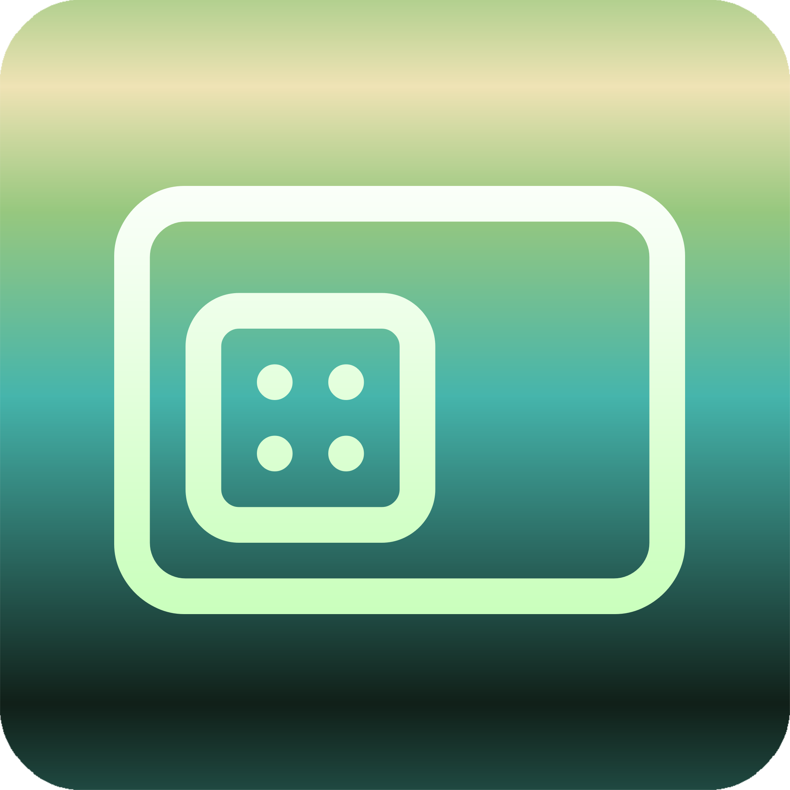
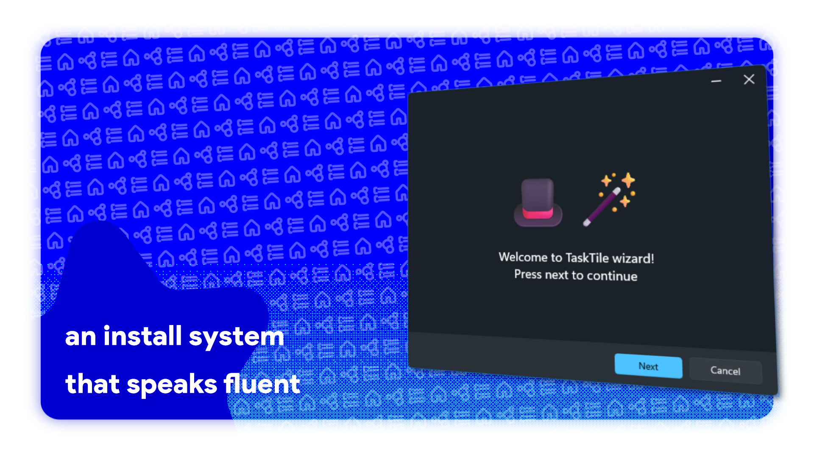
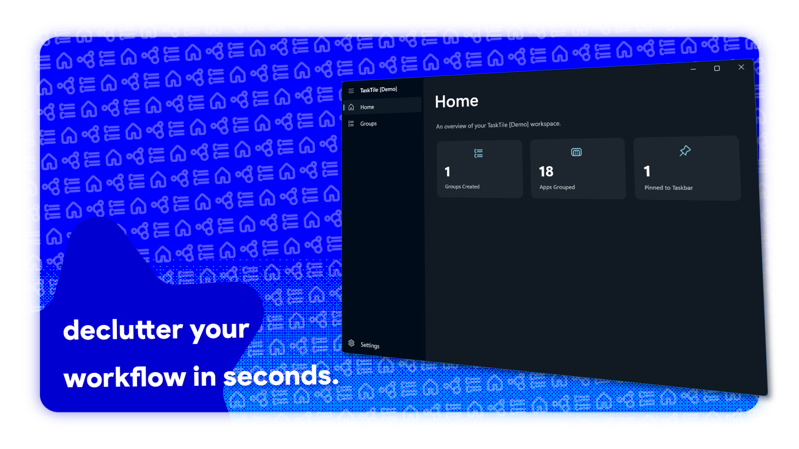
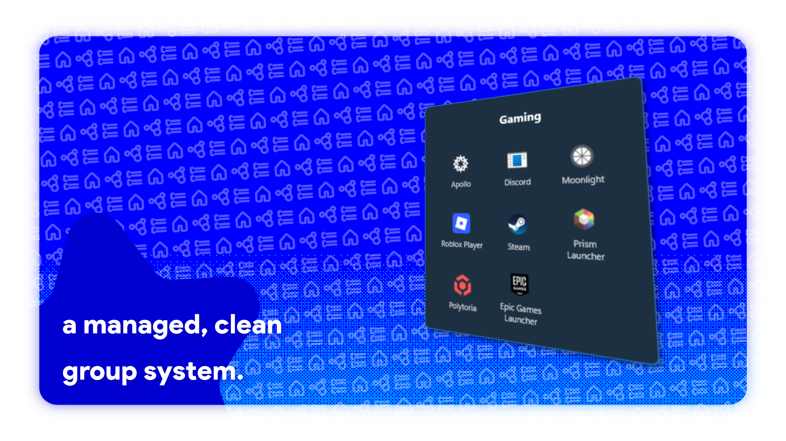
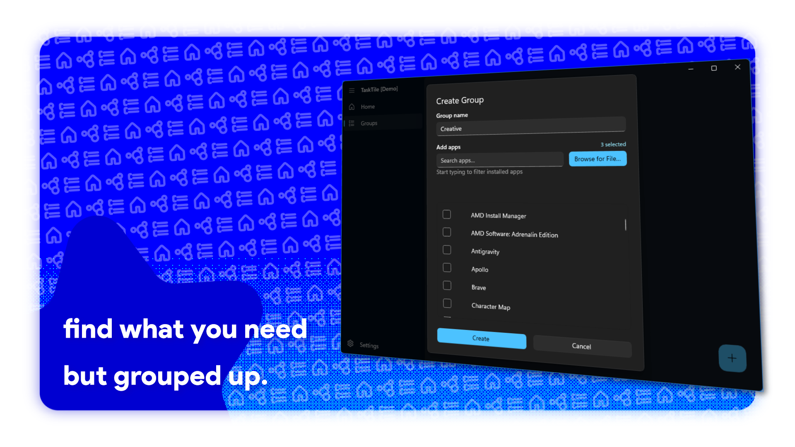



# TaskTile

**a truly *tactile* (ba dum tssh ;D) Windows 11 taskbar utility — lightweight and snappy.**

[-orange.svg?style=flat)](https://github.com/ypx13/TaskTile/releases)
[-red.svg?style=flat)](LICENSE)

[download the latest](https://github.com/ypx13/TaskTile/releases) • [features](#-features) • [quick start](#-quick-start-portable--no-installation-needed) • [about](#-about-the-project--developer-note) • [license](#-license--terms)

---

> [!WARNING]
> ### !! beta stage warning
> TaskTile is currently in active **Beta (Pre-v1.0)**. While yes it is feature-packed and daily-drivable, you **shouldn't completely rely on it** as some edges may be too sharp or subject to change at any time. Expect occasional quirks as polish continues!

---

## ✦ what is TaskTile exactly?

Meet **TaskTile** — yes, the name is a deliberate pun on **tactile**, because every click and transition is made completely in WinUI3 an C# making it pretty fast and smooth.

TaskTile might be the **first 100% native C# and WinUI 3 app group launcher/taskbar utility for Windows 11**. No Webview2, no PWA, none, i personally hate web apps, which is why i made TaskTile just pure WinUI 3, Windows App SDK, and low-level DWM compositing. It might be a little *over-engineered*, but that's for you to judge, and honestly? It might be why it feels.. built-in!

  
  
    
  
  

---

## features i think you might like 🫣

### 🗂️ app groups (obv), file groups & dynamic folders
- **app groups**: group your messy apps (*Dev, Gaming, Media*) into single taskbar icon you can click to launch everything from one menu, sort of like a mini start-menu.
- **file groups**: pin sets of documents, design assets, or portable tools together that launch with their default apps.
- **📁 dynamic folders (live sync)**: point to any local directory—TaskTile will automatically reads its contents and extracts native Windows icons in real-time. Drop a file in the folder, and it's immediately in your popup launching with it's default app!

### 5 layout styles, more to come 👀
1. **classic Grid**: the classic and original style here since the first version, it's styled to look Windows 11 Start Menu experience, but smol. Supports multi-page paging, pagination indicator dots, and smooth mouse wheel page switching.
2. **compact (Row / Column)**: ultra-slim 30px dock that can sit horizontally or vertically. Perfect for minimalist desktop setups.
3. **modern Grid**: floating card layout with customizable column counts (1 to 10 columns) and responsive spacing, it has no labels and more rounded hover styles to really push the clean aesthetic. 
4. **list**: clean vertical list with **built-in continuous marquee** and **hover auto-scrolling** for long application and file names.
5. **dialog-ish**: framed card layout featuring a centered footer title bar and compact action buttons, sort of like a Windows Dialog.

### Windows 11 design & materials 🫟
- **native backdrops**: choose between **Mica**, **Mica Alt**, **Desktop Acrylic**, or **Solid** backgrounds for each individual group.
- **live taskbar auto-hide tracking**: if your Windows taskbar is set to auto-hide, TaskTile dynamically syncs its position with the sliding taskbar in real-time, This one took a heck of a long time to figure out 🙄.
- **focus mode**: optional background dimming and desktop blur overlay for a distraction-free launch experience.

---

## quick start

1. **download**: grab `TaskTile.zip` from the [releases](https://github.com/ypx13/TaskTile/releases) page.
2. **extract**: unzip the folder anywhere you want. TaskTile is currently portable, but there will be an installer soon.
3. **create a group**: launch `TaskTile.exe` and customize your first app or file group.
4. **pin to taskbar**: click **Desktop Shortcut** on your card and pin the generated shortcut directly to your taskbar.

---

## developer's note

> *"Why do updates take so long?"*

TaskTile is being built by a **solo developer** (`ypx13`) who is learning advanced WinUI 3, XAML, and Windows API internals as he builds. 

icon extraction pipelines and animation, style programming and auto-hide tracking, literally everything is being made from scratch. If updates take a bit of time, it's because each release is being refined and tested to ensure it feels like real Windows 11 software. Feedback, testing, and issue reports are always greatly appreciated! 💖

---

## 📄 License & Terms

see the full [LICENSE](LICENSE) file for legal details. But I'm going to simply explain it here ⬇️

* **🔒 current status (pre-v1.0 — study & preview only)**:
  * **Educational & Personal Use Only**: You are welcome to inspect, read, and learn from the codebase.
  * **Strictly No Forking / No Cloning**: Nobody has permission to fork, clone, copy, redistribute, or claim this project as their own during the pre-v1.0 development phase.
  * **No Commercialization**: Nobody can sell, paywall, or monetize this software.
* **🔓 future status (Version 1.0 Stable & Beyond)**:
  * Upon the official v1.0 milestone, the project will open under a **Non-Commercial Community License** allowing forks and community editions, provided that **mandatory attribution (credit to ypx13)** and **strict non-commercial terms** are honored.

  baked with 💖 using WinUI 3 & .NET 8 • TaskTile by ypx13

