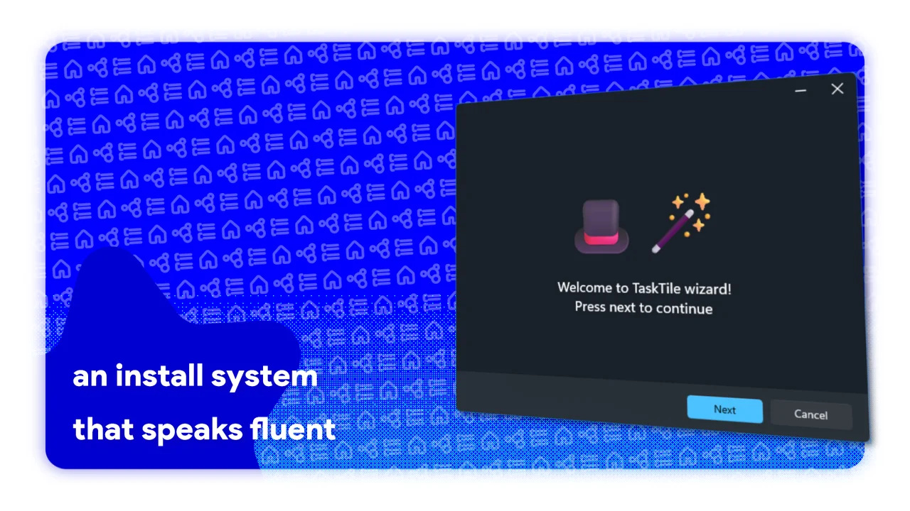



# TaskTile

**A truly *tactile* Windows 11 taskbar utility — lightweight, snappy, and click-perfect.**

[-orange.svg?style=flat)](https://github.com/ypx13/TaskTile/releases)
[-red.svg?style=flat)](LICENSE)

[📦 Download Latest Release](https://github.com/ypx13/TaskTile/releases) • [✨ Features](#-features) • [🚀 Quick Start](#-quick-start-portable--no-installation-needed) • [🧑‍💻 About the Project](#-about-the-project--developer-note) • [📄 License](#-license--terms)

---

> [!WARNING]
> ### ⚠️ Pre-v1.0 Beta Notice
> TaskTile is currently in active **Beta (Pre-v1.0)**. While it is feature-packed and daily-drivable, you **should not completely rely on it for critical mission-critical workflows** as some edges may be unstable or subject to rapid iteration. Expect occasional quirks as polish continues!

---

## ✦ What is TaskTile?

Meet **TaskTile** — yes, the name is a deliberate pun on **tactile**, because every click, hover, and transition feels crisp, snappy, and click-perfect with zero background drag.

TaskTile is the **first 100% native C# and WinUI 3 app group launcher for Windows 11**. No bloated Electron wrappers, no web views, and no laggy web technologies — just pure WinUI 3, Windows App SDK, and low-level DWM compositing. It might be a little *over-engineered*, but that's exactly why it feels like an authentic, built-in part of Windows 11.

  

  
🖼️ The pictures if the slideshow isn't working for you

   
  

    
    
    
    
  

---

## ✨ Features That Actually Matter

### 🗂️ App Groups, File Groups & Dynamic Folders
- **App Launchers**: Group your workflow apps (*Dev, Gaming, Media, Adobe Suite*) into single, clutter-free taskbar icons.
- **File Groups**: Pin sets of documents, design assets, or portable tools together.
- **📁 Dynamic Folders (Live Sync)**: Point to any local directory—TaskTile automatically reads its contents and extracts native Windows icons in real-time. Drop a file in the folder, and it's immediately in your popup!

### 🎨 5 Distinct Popup Layout Styles
1. **Classic Grid**: The Windows 11 Start Menu experience in miniature. Supports multi-page paging, pagination indicator dots, and smooth mouse wheel page switching.
2. **Compact (Row / Column)**: Ultra-slim 30px dock that can sit horizontally or vertically. Perfect for minimalist desktop setups.
3. **Modern Grid**: Floating card layout with customizable column counts (1 to 10 columns) and responsive spacing.
4. **List**: Clean vertical list with **built-in continuous marquee** and **hover auto-scrolling** for long application and file names.
5. **Dialog-ish**: Framed card layout featuring a centered footer title bar and compact action buttons.

### 🪟 Authentic Windows 11 Design & Materials
- **Native Backdrops**: Choose between **Mica**, **Mica Alt**, **Desktop Acrylic**, or **Solid** backgrounds for each individual group.
- **Hardware Rounded Corners**: Native DWM corner rounding that syncs with Windows 11 system preferences.
- **Custom Borders & Light Theme**: Customize border strokes, accent colors, or force Light/Dark/OLED Black per group.
- **Live Taskbar Auto-Hide Tracking**: If your Windows taskbar is set to auto-hide, TaskTile dynamically syncs its position with the sliding taskbar in real-time.
- **Focus Mode**: Optional background dimming and desktop blur overlay for a distraction-free launch experience.

---

## 🚀 Quick Start (Portable — No Installation Needed)

1. **Download**: Grab `TaskTile.zip` from the [Releases](https://github.com/ypx13/TaskTile/releases) page.
2. **Extract**: Unzip the folder anywhere you want. TaskTile is **100% portable** — no registry installers, no background services, no bloat.
3. **Create a Group**: Launch `TaskTile.exe` and customize your first app or file group.
4. **Pin to Taskbar**: Click **Desktop Shortcut** on your card and pin the generated shortcut directly to your taskbar.

---

## 🧑‍💻 About the Project & Developer Note

> *"Why do updates take a little time?"*

TaskTile is being built by a **solo developer** (`ypx13`) who is learning advanced WinUI 3, XAML, and Windows API internals as he builds. 

Every pixel, custom backdrop shader, icon extraction pipeline, and animation is being hand-crafted from scratch. If updates take a bit of time, it's because each release is being refined and tested to ensure it feels like real Windows 11 software. Feedback, testing, and issue reports are always greatly appreciated!

---

## 📄 License & Terms

See the full [LICENSE](LICENSE) file for legal details.

* **🔒 Current Status (Pre-v1.0 — Study & Preview Only)**:
  * **Educational & Personal Use Only**: You are welcome to inspect, read, and learn from the codebase.
  * **Strictly No Forking / No Cloning**: Nobody has permission to fork, clone, copy, redistribute, or claim this project as their own during the pre-v1.0 development phase.
  * **No Commercialization**: Nobody can sell, paywall, or monetize this software.
* **🔓 Future Status (Version 1.0 Stable & Beyond)**:
  * Upon the official v1.0 milestone, the project will open under a **Non-Commercial Community License** allowing forks and community editions (e.g. *TaskTile+*), provided that **mandatory attribution (credit to ypx13)** and **strict non-commercial terms** are honored.

  Handcrafted with 💖 using WinUI 3 & .NET 8 • TaskTile by ypx13

